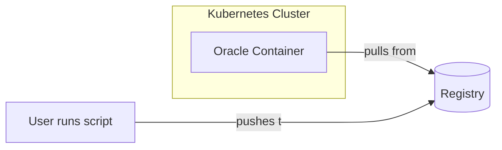
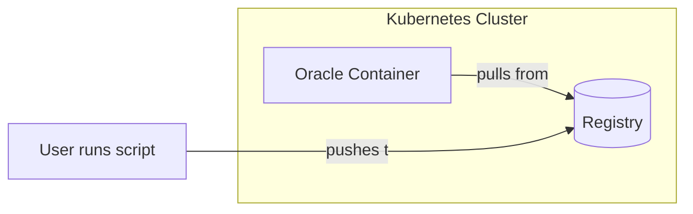
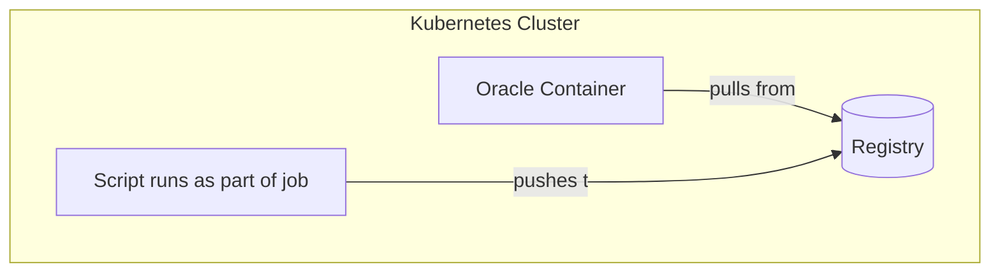

```mermaid
flowchart LR
    A--pulls from-->B[("Registry")]
    subgraph Kubernetes Cluster
    A["Oracle Container"]
    end
    C["User runs script"]--pushes to-->B
```

```mermaid
flowchart LR
    A--pulls from-->B[("Registry")]
    subgraph Kubernetes Cluster
    A["Oracle Container"]
    B
    end
    C["User runs script"]--pushes to-->B
```

```mermaid
flowchart
    A--pulls from-->B[("Registry")]
    subgraph Kubernetes Cluster
    A["Oracle Container"]
    B
    C
    end
    C["Script runs as part of job"]--pushes to-->B
```