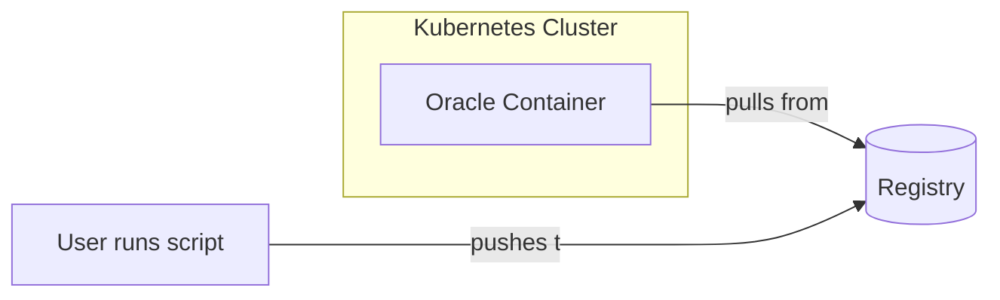
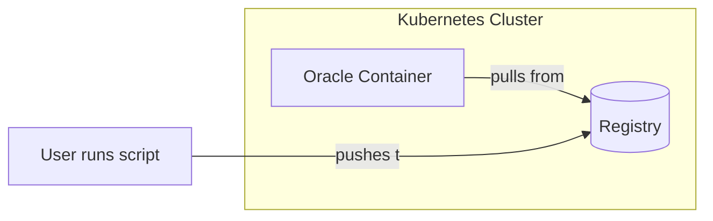
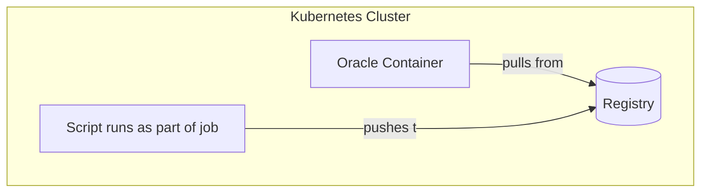

1. `kubectl apply -f registry.yaml`
2. `kubectl apply -f configmap.yaml`
3. `kubectl port-forward service/registry 30007:443 &`
4. `curl https://localhost:30007/v2/_catalog -k`
5. `kubectl apply -f build.yaml`
6. `curl https://localhost:30007/v2/_catalog -k`

`kill $!`

